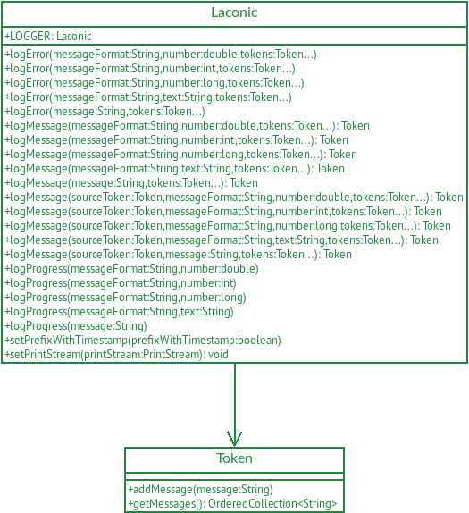

# Laconic Logging

The aim of this project is to provide a logging framework that by design only outputs log messages when something goes
wrong during the execution of a program, and only outputs the log messages related to the error that occurred.

This project is inspired by the talk
[You are doing logging in .NET wrong. Let’s fix it](https://www.youtube.com/watch?v=Aih9AESZEmo) by
[Nick Chapsas](https://x.com/nickchapsas) given at the [Copenhagen Developers Festival](https://cphdevfest.com/fest) in
2023.

* [Overview](#overview)
* [Getting Started](#getting-started)
* [Projects Using Laconic](#projects-using-laconic)

## Overview



## Getting Started

First of all, you need to obtain a copy of the source code, complile it and install it locally. Run the following
commands to do this:

```
git clone git@github.com:filipvanlaenen/laconic.git
cd laconic
mvn clean install
```

*Note: If requested by enough people, this library can be deployed to a central Maven repository
([Issue #1](https://github.com/filipvanlaenen/laconic/issues/1)).*

If everything works well, you'll be able to use the Laconic Logging library in another Java project by adding the
following dependency in the project's POM file:

```xml
  <dependency>
    <groupId>net.filipvanlaenen</groupId>
    <artifactId>laconic</artifactId>
    <version>1.0-SNAPSHOT</version>
  </dependency>
```

Be sure to update to the appropriate version number.

With Laconic Logging, you can log an error message as follows:

```java
  import net.filipvanlaenen.laconic.Laconic;

  Laconic.LOGGER.logError("Something went wrong."); 
```

This will print the following message to `System.err`:

```
‡ Something went wrong.
```

You can include messages that you've logged using a token like this:

```java
  import net.filipvanlaenen.laconic.Laconic;
  import net.filipvanlaenen.laconic.Token;

  Token token = Laconic.LOGGER.logMessage("Something happened.");
  Laconic.LOGGER.logMessage("Something else happened.", token);
  Laconic.LOGGER.logError("Something went wrong.", token);
```

This will print the following messages to `System.err`:

```
‡   Something happened.
‡ ⬐ Something else happened.
‡ Something went wrong.
```

Not everything is strictly linear though, and sometimes an error can be caused by more than one thing. You can include
different lines of messages as follows:

```java
  import net.filipvanlaenen.laconic.Laconic;
  import net.filipvanlaenen.laconic.Token;

  Token token1 = Laconic.LOGGER.logMessage("Something happened.");
  Laconic.LOGGER.logMessage("Something else happened.", token1);

  Token token2 = Laconic.LOGGER.logMessage("Started something else.");
  Laconic.LOGGER.logMessage("Continued something else.", token2);
  
  Laconic.LOGGER.logError("Something went wrong.", token1, token2);
```

This will print the following messages to `System.err`:

```
‡   Something happened.
‡ ⬐ Something else happened.
‡   Started something else.
‡ ⬐ Continued something else.
‡ Something went wrong.
```

On the other hand, the same line of messages can also cause more than one error:

```java
  import net.filipvanlaenen.laconic.Laconic;
  import net.filipvanlaenen.laconic.Token;

  Token token = Laconic.LOGGER.logMessage("Something happened.");
  Laconic.LOGGER.logMessage("Something else happened.", token);
 
  Laconic.LOGGER.logError("Something went wrong.", token);

  Laconic.LOGGER.logError("Something else went wrong.", token);
```

This will print the following messages to `System.err`:

```
‡   Something happened.
‡ ⬐ Something else happened.
‡ Something went wrong.

‡   Something happened.
‡ ⬐ Something else happened.
‡ Something else went wrong.
```

## Projects Using Laconic Logging

The following projects use Laconic Logging:
